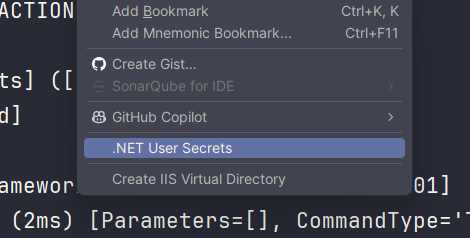
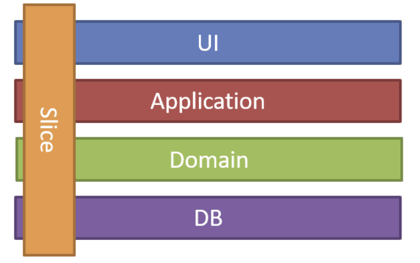

# Introduction

Coding Challenge

- Customer.Host: The main component of the application, API Rest

# Prerequisites

- .NET Core SDK 8.0.405. (<https://dotnet.microsoft.com/en-us/download/dotnet/8.0>), you can set another version in the Global.json, but the minimum is .NET 8.0.
- Docker or local sql server instance
- Configure Secret in the project `Customer.Host`. 



- Add ConnectionString
```json
"ConnectionStrings": {
  "Default": "Server=127.0.0.1;Persist Security Info=True;Database=Customer;User Id=sa;Password=Your_Passw0rd;TrustServerCertificate=True;"
}
```

# Getting Started

## There are three processes:

1. **Dotnet run. It’s necessary to run the app**:

- First, run Docker with the SQL Server container.

```shell
docker-compose up db-customer
```

- Second, run the API.

```shell
cd .\src\Customer.Host\
dotnet run
```

Click on the [link](http://localhost:5107/swagger/index.html)

2. **Docker compose**. Root Folder

```shell
docker compose build
docker compose up -d
```

Click on the [Link](http://localhost:5017/swagger/index.html)

3. **From your favorite IDE**.
   You must run the project:

- First, run Docker with the SQL Server container.

```shell
docker-compose up db-customer
```

- Customer.Host

# Build and Test

## Testing

- Docker must be running with the SQL Server container or local sql server Local.
```shell
docker-compose up db-customer
```
- Run tests: Unit and integration
```shell
dotnet test
```

## Generate Docker image

You should change the server ``Server=myServerAddress`` to the name of yours, for example: 127.0.0.1, the password too ``Password=Your_PasswOrd;``.

If you have the database in a docker container, you should add to the server this  in `Server=host.docker.internal`

```shell
docker build -t customer-app -f deploy/Dockerfile .

docker run -d -p 5017:8080 --name customer-app -e "ASPNETCORE_ENVIRONMENT=Development" -e "ConnectionStrings__Default=Server=myServerAddress;Persist Security Info=True;Database=customer;User Id=sa;Password=.Your_PasswOrd;TrustServerCertificate=True;" customer-app
```

You can also pull the image from [the GitHub registry](https://github.com/franjfgcarmo/coding-challenge/pkgs/container/coding-challenge%2Fcustomer-api)

```shell
docker pull ghcr.io/franjfgcarmo/coding-challenge/customer-api:033a8a1
```

## Continuous Integration

| Name | Description                                                | Status                                                                                                                                                                                                                   |
| ---- | ---------------------------------------------------------- | ------------------------------------------------------------------------------------------------------------------------------------------------------------------------------------------------------------------------ |
| CI   | Execute code validation steps: Build, tests, code analysis | [](https://github.com/franjfgcarmo/coding-challenge/actions/workflows/ci.yml) |

# Architecture

## Introduction

I have applied DDD architecture that proposes to develop a design within each layer that is cohesive and that depends only on the layers below. Concentrate all the code related to the domain model and business rules in one layer and isolate it from the user interface, application, and infrastructure code. In addition, I have used the MediatR NuGet package, which is designed to apply vertical slice architecture and avoid coupling between horizontal layers (DTOs, repository, and so on).



For errors 400 and 500, I have used Problem Details, which is a standard way to carry machine-readable details of errors in an HTTP response to avoid the need to define new error response formats for HTTP APIs. [Learn more about Problem Details](https://learn.microsoft.com/en-us/dotnet/api/microsoft.aspnetcore.mvc.problemdetails?view=aspnetcore-8.0).

The deployment process hasn’t been implemented, but through continuous integration, we could include new tasks to generate Docker images and deploy.

## Folder Structure

- **.github**: CI with the steps: build, test (run unit and integration test), and delivery (generate Docker image)
- **Deploy**: Contains Dockerfile.
- **Solution Items**: Global configurations such as build.props, NuGet configuration.
- **Src**:
  - Customer.Host: This project is the host. I separated it from the API because it’s easier for End2End tests. This scenario isn’t necessary because we don’t have Authentication and Authorization.
  - Customer.Api: Contains the API and infrastructure layers. It can be separated into another project, but these go together.
  - Customer.Domain: This project has "the business rules" and Entities, so it is separated from the rest of the layers.
- **Test**:
  - Customer.Domain.UnitTest: There should be more tests, but Customer is an anemic class
  - Customer.Api.IntegrationTest: I try to test all use cases: create, update, delete, get and list.
